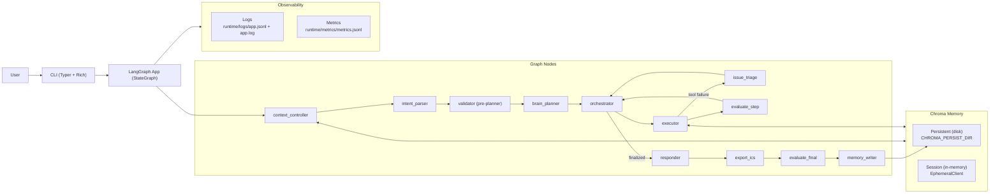

# AI Travel Agent — Architecture & How It Works

This repository implements a **links-only AI travel agent** using:

- **LangGraph** for orchestration (a state machine / graph of nodes)
- **LangChain** for LLM integration (Ollama + Qwen by default)
- **Chroma** for memory (persistent + in-memory session stores)
- **Structured logging + metrics + evaluation** to make runs observable and measurable

The MVP produces:

- Flight/hotel/things-to-do **search links** (no booking)
- A day-by-day itinerary
- Weather (best-effort; degrades gracefully)
- A rough budget section (heuristic; no live prices)
- An `.ics` calendar export

---

## How to Run (Quick Summary)

1. Start Ollama: `ollama serve`
2. Pull a model: `ollama pull qwen2.5:7b-instruct`
3. Install deps: `pip install -e ".[dev,embeddings]"` (or `pip install -r requirements.txt`)
4. Configure: `cp .env.example .env`
5. Run: `ai-travel-agent`

Outputs:

- Logs: `runtime/logs/app.jsonl`, `runtime/logs/app.log`
- Metrics: `runtime/metrics/metrics.jsonl`
- Calendar: `runtime/artifacts/*.ics`

---

## High-Level Diagram (Conceptual)

Your original design translates to these components:

- **Context Controller**: retrieves memory to ground the request
- **Planner Agent**: breaks the task into steps
- **Orchestrator**: selects the next step to execute
- **Executor**: runs tools / calls the LLM for synthesis
- **Evaluator**: scores output and enforces hard gates
- **Result**: final plan shown to the user and written to memory
- **Memory Store**:
  - Persistent Chroma (long-term)
  - In-memory Chroma (session)

### Component Diagram (High-level)



---

## Runtime Data Flow (LangGraph)

The agent runs as a LangGraph state machine. Each node reads/writes a shared state object.

```mermaid
flowchart TD
  A[context_controller] --> B[intent_parser]
  B -->|needs_user_input| Z[END (ask user)]
  B -->|ok| V[validator (pre-planner)]
  V -->|needs_user_input| Z
  V -->|ok| C[brain_planner]
  C --> D[orchestrator]
  D -->|step pending| E[executor]
  E -->|tool failed| T[issue_triage]
  T -->|ask user| Z
  T -->|skip/retry| D
  E --> F[evaluate_step]
  F --> D
  D -->|all done| R[responder]
  R --> I[export_ics]
  I --> J[evaluate_final]
  J --> K[memory_writer]
  K --> Y[END]
```

Source: `ai_travel_agent/graph.py`.

### Stop Conditions

- `needs_user_input=True`: the graph stops early so the CLI can ask clarifying questions.
- `termination_reason="finalized"`: no steps remain; move to response + export + evaluation.
- `termination_reason="max_iters"`: guardrail stops the loop after too many orchestrations.

---

## The State Object (What Moves Through the Graph)

LangGraph state is a dictionary shaped by `AgentState`.

Key fields:

- `user_query`: the user’s current request (plus appended clarifying answers)
- `constraints`: extracted structured constraints (origin, destination, dates, budget, interests, pace)
- `context_hits`: retrieved memory snippets (persistent + session)
- `plan`: list of steps, each with:
  - `id`, `title`, `step_type`, optional `tool_name/tool_args`, and `status`
- `tool_results`: structured tool outputs used later for synthesis
- `final_answer`: the Markdown response returned to the user
- `ics_path`, `ics_event_count`: path/count for calendar export
- `evaluation`: hard-gate + rubric results for the run
- `current_node`, `current_step`, `current_step_index`: used for CLI progress display and logs

Source: `ai_travel_agent/agents/state.py`.

---

## Nodes (Modules) and Responsibilities

### 1) `context_controller`

- Reads `user_query`
- Retrieves memory via Chroma:
  - persistent user memory
  - in-memory session memory
- Stores retrieved snippets in `context_hits`

Source: `ai_travel_agent/agents/nodes/context_controller.py`.

### 2) `intent_parser`

- Uses the LLM to extract `TripConstraints` as **strict JSON**
- Sets `needs_user_input=True` and provides `clarifying_questions` if required fields are missing

Source: `ai_travel_agent/agents/nodes/intent_parser.py`.

### 3) `validator` (pre-planner validation/grounding)

Runs before planning to prevent the agent from planning on bad inputs.

Responsibilities:

- Deterministic validation/normalization of dates (ISO `YYYY-MM-DD`)
- Core-field checks (origin, destination(s), start/end dates)
- Memory conflict detection (always asks you if memory conflicts with the current request)
- Place grounding via geocoding (Open‑Meteo geocoding). If ambiguous **or no results**, asks you to disambiguate/correct.
- Produces `grounded_places` (canonical names + lat/lon when available)

Source: `ai_travel_agent/agents/nodes/validator.py`.

### 4) `brain_planner` (LLM-driven plan + tool selection)

Uses the LLM as the “brain” to:

- Decompose the task into steps
- Select which tools to run and their arguments
- Optionally insert additional `RETRIEVE_CONTEXT` steps if more RAG retrieval is needed

If the planner returns invalid JSON, the system falls back to the deterministic `planner`.

Source: `ai_travel_agent/agents/nodes/brain_planner.py` (fallback: `ai_travel_agent/agents/nodes/planner.py`).

### 5) `planner` (deterministic fallback)

- Converts constraints into a concrete list of steps:
  - tool calls (links + weather)
  - a final synthesis step

Source: `ai_travel_agent/agents/nodes/planner.py`.

### 6) `orchestrator`

- Picks the next `pending` step from the plan
- Sets `current_step` and `current_step_index`
- Stops when no pending steps remain
- Includes a **loop guard** that sets `termination_reason="max_iters"` if it iterates too long

Source: `ai_travel_agent/agents/nodes/orchestrator.py`.

### 7) `executor`

- If current step is `TOOL_CALL`: executes a Python tool from the tool registry and stores a `ToolResult`
- If current step is `RETRIEVE_CONTEXT`: performs an additional Chroma retrieval (agentic RAG) and updates `context_hits`
- If current step is `SYNTHESIZE`: calls the LLM to produce the final Markdown itinerary

Source: `ai_travel_agent/agents/nodes/executor.py`.

### 8) `issue_triage` (LLM-led error triage)

If a tool fails after bounded retries, an Issue is created and triaged.

Policy:
- Blocking issues (core input problems) always ask you.
- Major issues (flight/lodging link tools) usually ask you.
- Minor issues (weather/things-to-do) are usually skipped so the agent can continue.

Source: `ai_travel_agent/agents/nodes/issue_triage.py`.

### 9) `evaluate_step`

- Lightweight checks per step (MVP)
- Emits evaluation logs/metrics hooks (future expansion point)

Source: `ai_travel_agent/agents/nodes/evaluator.py`.

### 10) `responder`

- Post-processes and enforces output format constraints:
  - makes sure the disclaimer appears once
  - adds missing required sections if absent
  - strips numeric price claims (links-only MVP)

Source: `ai_travel_agent/agents/nodes/responder.py`.

### 11) `export_ics`

- Generates an `.ics` calendar file from dates (and optional day titles)
- Writes to `runtime/artifacts/`

Source: `ai_travel_agent/agents/nodes/export_ics.py`.

### 12) `evaluate_final`

Applies:

- **Hard gates** (pass/fail)
- **Rubric scores** (0–5 each)

And sets:

- `evaluation.overall_status` in `{good, needs_work, failed}`

Source: `ai_travel_agent/evaluation.py` and `ai_travel_agent/agents/nodes/evaluator.py`.

### 13) `memory_writer`

Writes:

- Persistent memory:
  - extracted stable preferences (e.g., interests)
  - profile signals (e.g., home origin)
  - trip summary (constraints + evaluation)
- Session memory:
  - tool outputs

Source: `ai_travel_agent/agents/nodes/memory_writer.py`.

---

## Tools (Links-First, No Booking)

Tools are plain Python functions registered in a registry and called by name:

- `flights_search_links` → Google Flights, Skyscanner
- `hotels_search_links` → Booking.com, Google Maps
- `things_to_do_links` → Google Maps searches
- `weather_summary` → Open-Meteo best-effort (graceful fallback to links)
- `create_itinerary_ics` → `.ics` generation (used by export node)

Source: `ai_travel_agent/tools/`.

Important: tools return **structured JSON** (`summary`, `links`, and optional details). This keeps outputs auditable and easy to log.

---

## Memory (Chroma): Persistent vs In-Memory

The app uses **two Chroma clients**:

1. **Persistent user memory (on disk)**
   - Stored at `CHROMA_PERSIST_DIR` (default: `./data/chroma_persistent`)
   - Used for: long-term preferences and trip summaries

2. **Session memory (non-persistent, in-memory)**
   - Stored in RAM using Chroma’s `EphemeralClient`
   - Cleared when the process exits
   - Used for: tool outputs and short-term run context

Source: `ai_travel_agent/memory/store.py`.

Embeddings:

- Uses `sentence-transformers` if installed (default model: `all-MiniLM-L6-v2`)
- Falls back to deterministic hash embeddings if sentence-transformers is unavailable

Source: `ai_travel_agent/memory/embeddings.py`.

Note: the first run may download and cache the embedding model, which can take time and show progress bars.

---

## System Prompts (Where They Live)

This repo keeps prompts close to the node that uses them:

- Intent extraction prompt: `ai_travel_agent/agents/nodes/intent_parser.py` (`SYSTEM`)
- Brain planner prompt (JSON plan output): `ai_travel_agent/agents/nodes/brain_planner.py` (`SYSTEM`)
- Synthesis prompt (final Markdown itinerary): `ai_travel_agent/agents/nodes/executor.py` (`SYNTH_SYSTEM`)
- Issue triage prompt (JSON decision): `ai_travel_agent/agents/nodes/issue_triage.py` (`SYSTEM`)

Important:

- The agent does **not** log chain-of-thought. Logs include only short planner `notes` (1–2 sentences) and tool summaries.
- The MVP is **links-only** (no booking, no live prices/availability claims).

---

## Observability: Logs and Metrics

### Logs (JSONL + text)

Written to:

- `runtime/logs/app.jsonl`
- `runtime/logs/app.log`

Every log event has a consistent schema:

- `timestamp`, `level`, `module`, `message`
- `run_id`, `user_id`
- `graph_node`, `step_type`, `step_id`, `step_title`
- `event` (e.g., `node_enter`, `tool_result`, `eval_final`)
- `data` (structured payload; sensitive keys are redacted)

Source: `ai_travel_agent/observability/logger.py`.

### Metrics (one record per run)

Written to:

- `runtime/metrics/metrics.jsonl`

Includes:

- total latency
- counters (LLM calls, tool calls, node transitions, memory writes)
- timers (latency buckets per node/tool)
- evaluation results (hard gates + rubric scores)
- output metrics (link count, itinerary days, ICS path)

Source: `ai_travel_agent/observability/metrics.py` and `ai_travel_agent/cli.py`.

---

## Evaluation (Why a Run Can “Fail” Even With Output)

Evaluation is separate from “did the agent produce an itinerary?”

- A run can produce output but still be marked `failed` if any **hard gate** fails.
- Example: quoting specific flight prices in a links-only MVP would fail the “no fabricated real-time facts” gate.

Hard gates and rubric scoring logic live in `ai_travel_agent/evaluation.py`.

---

## CLI: Step-Aware Progress Display

The CLI uses LangGraph’s debug event stream to show progress **as soon as a node starts**, so long tool/LLM calls still show “what’s running”.

Displayed fields:

- `Node: <graph_node>`
- `Step: <step_type> | <step_index>/<plan_len>`
- `<step_title>`

Source: `ai_travel_agent/cli.py`.

---

## Why Runs Can Be Slow (And What To Do)

The main contributors are:

- **LLM speed** (Ollama + model size): `qwen2.5:7b-instruct` on CPU can be slow for long outputs.
- **Output length**: the synthesis step can generate many tokens.
- **Embeddings** (`sentence-transformers`): first run downloads the model; indexing/writing memory requires embedding compute.
- **Network tools**: geocoding/weather calls may wait on timeouts if offline.

Practical levers:

- Use a smaller Ollama model by setting `OLLAMA_MODEL` to something lighter and pulling it in Ollama.
- Ask for a shorter itinerary (fewer days, fewer destinations) to reduce generation time.

---

## Extending the System

Common extension points:

- Add real APIs (flights/hotels/POI) by adding new tools in `ai_travel_agent/tools/` and referencing them from `planner`.
- Improve planning by adding a `PLAN_REFINE` node and routing based on `evaluate_step`.
- Add a web API (FastAPI) by reusing `build_app(...)` and returning `final_answer/ics_path/evaluation`.
- Add richer evaluation rules (consistency checks, missing-section checks, link domain allowlists).

---

## File/Module Map

- Orchestration: `ai_travel_agent/graph.py`
- CLI UX: `ai_travel_agent/cli.py`
- Nodes: `ai_travel_agent/agents/nodes/`
- State + schemas: `ai_travel_agent/agents/state.py`
- Tools: `ai_travel_agent/tools/`
- Memory: `ai_travel_agent/memory/`
- Logging + metrics: `ai_travel_agent/observability/`
- Evaluation: `ai_travel_agent/evaluation.py`
